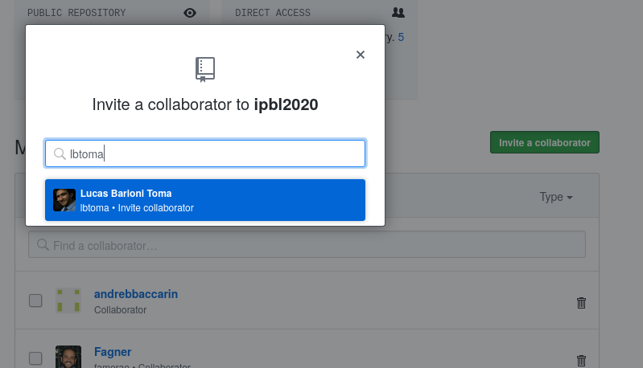
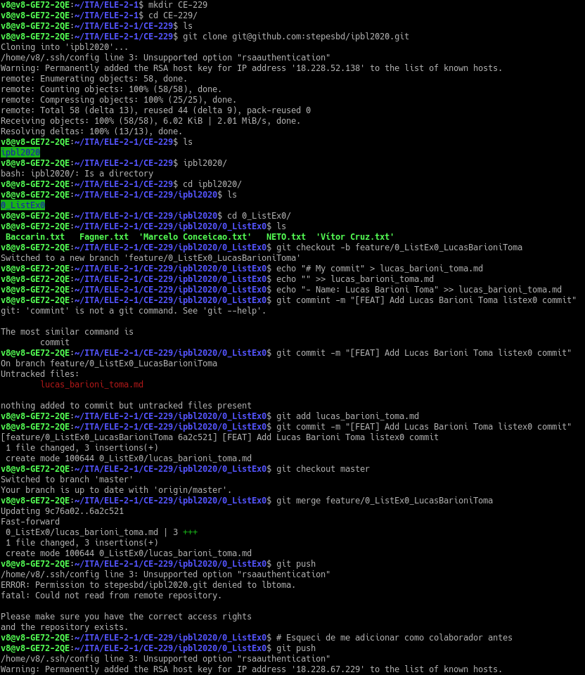
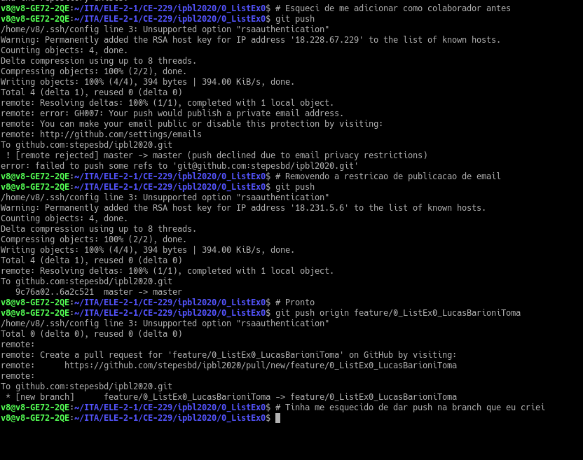
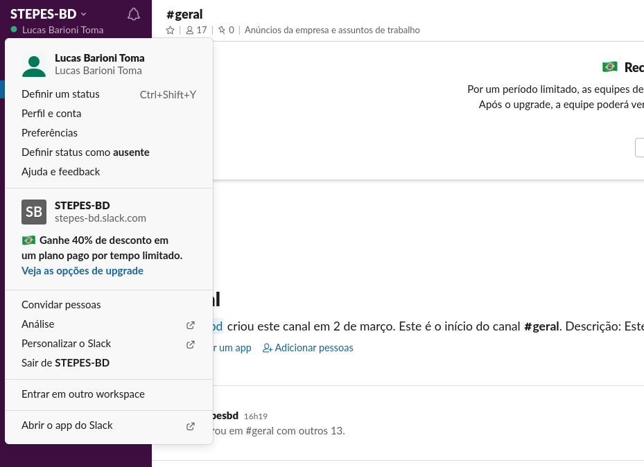

# ListEx0

---

## 3.1 - Elaboração e/ou atualização de Página de Índices Individuais, via Google Sites

Constitui-se desta página de índices individuais.

## 3.2 - Utilização das ferramentas Git e Github

Primeiramente, adicionei-me como contribuidor do repositório:

E realizei as operações no terminal, conforme mostrado nos *snapshots* abaixo:

Não houve problemas de conflito entre branches.

## 3.3 - Fórum Geral (Ferramenta Slack) do Projeto de STEPES-BD

*Snapshot*:

