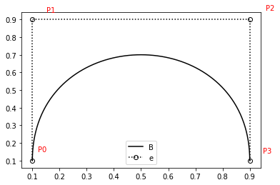

<style>
.ant-tabs-tabpane-active p {
  text-align: justify;
}

.ant-tabs-tabpane-active table, th, td {
  border: 1px dotted black;
}

.ant-tabs-tabpane-active pre {
  background-color: #EEEEEE;
  margin: 20px;
  padding: 10px;
  border: 2px dotted black;
  width: 80%;
}
</style>

# Terceiro caça ao tesouro - Semana 06

Time: TS02 - Médicos - 2020-04-09
- Alexandre Pimentel
- Vinicius Lippi
- Andre Baccarin
- Lucas Barioni


```python
# Código feito por Lucas Barioni
import matplotlib.pyplot as plt
import numpy as np
from scipy.special import comb as n_over_k
from random import random

def plot_curve(verts):
  Mtk = lambda n, t, k: t**k * (1-t)**(n-k) * n_over_k(n,k)
  BezierCoeff = lambda ts: [
    [Mtk(len(verts) - 1,t,k) for k in range(len(verts))] for t in ts
  ]

  fcn = np.log
  tPlot = np.linspace(0. ,1. , 81)
  xPlot = np.linspace(0.1,2.5, 81)
  tData = tPlot[0:81:10]
  xData = xPlot[0:81:10]

  verts_arr = np.array(verts)
  Bezier = np.array(BezierCoeff(tPlot)).dot(verts_arr)

  fig, ax = plt.subplots()

  ax.plot(Bezier[:,0],
          Bezier[:,1],         'k-', label='fit')
  ax.plot(verts_arr[:,0],
          verts_arr[:,1],  'ko:', fillstyle='none')
  ax.legend("Bezier")

  random_offset = lambda: 0.04 + 0.04*(0.5 - random())
  ax.text(verts[0][0] + random_offset(), verts[0][1] + random_offset(), 'P0', color='red')
  for (i, v) in enumerate(verts[1:]):
    ax.text(v[0] + random_offset(), v[1] + random_offset(), f'P{i + 1}', color='red')

  fig.show()
```


```python
#EXEMPLO:

verts = [
  (0.1, 0.1),
  (0.1, 0.9),
  (0.9, 0.9),
  (0.9, 0.1),
]

plot_curve(verts)

```





## Casos de teste:


```python
# LETRA A: 
# Vinicius Paes Lippi
verts = [
         (0.2, 0.1),
         (0.1, 0.8),
         (0.4, 0.9),
         (0.4, 0.2),
]

plot_curve (verts)
```


```python
# LETRA B:
# Vinicius Paes Lippi
verts = [
         (0.25, 0.1),
         (0.1, 0.8),
         (0.6, 0.2),
         (0.7, 0.9),
]

plot_curve (verts)
```


```python
# LETRA C:
# Vinicius Paes Lippi
verts = [
         (0.2, 0.1),
         (0.1, 0.8),
         (0.3, 0.9),
         (0.3, 0.2),
         (0.25, 0.5),
]

plot_curve (verts)
```


```python
# LETRA D:
# André Benzi Baccarin
verts = [
  (0.1, 0.2),
  (0.9, 0.7),
  (0.6, 0.9),
  (0.3, 0.7),
  (0.8, 0.1),
]

plot_curve(verts)
```


