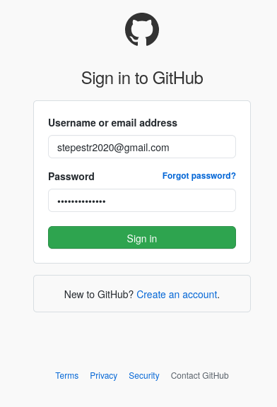

# ListEx 0

## 3.1 Elaboração e/ou Atualização das Páginas de Índices Individuais, via Google Sites

Página disponível em: https://sites.google.com/view/lucas-barioni-toma


## 3.2 Utilização das Ferramentas Git e GitHub


Adicionando como colaborador:




Clonando o repositório, criando uma nova branch, fazendo um novo commit e mergeando:

```bash
v8@ge72-apache:~/ITA/ELE-2-2/CE-237$ git clone git@github.com:stepestr/ipbl2020.git
Cloning into 'ipbl2020'...
/home/v8/.ssh/config line 3: Unsupported option "rsaauthentication"
remote: Enumerating objects: 36, done.
remote: Counting objects: 100% (36/36), done.
remote: Compressing objects: 100% (24/24), done.
remote: Total 36 (delta 3), reused 24 (delta 1), pack-reused 0
Receiving objects: 100% (36/36), 5.19 KiB | 1.30 MiB/s, done.
Resolving deltas: 100% (3/3), done.
v8@ge72-apache:~/ITA/ELE-2-2/CE-237$ ls
ipbl2020  lbtoma-site
v8@ge72-apache:~/ITA/ELE-2-2/CE-237$ cd ipbl2020/
v8@ge72-apache:~/ITA/ELE-2-2/CE-237/ipbl2020$ echo "# Lucas Barioni Toma First Commit" > lucas-barioni-toma-first-commit.md 
v8@ge72-apache:~/ITA/ELE-2-2/CE-237/ipbl2020$ echo "" > lucas-barioni-toma-first-commit.md                                  
v8@ge72-apache:~/ITA/ELE-2-2/CE-237/ipbl2020$ echo "This is my first commit" > lucas-barioni-toma-first-commit.md                                
v8@ge72-apache:~/ITA/ELE-2-2/CE-237/ipbl2020$ cat lucas-barioni-toma-first-commit.md 
This is my first commit
v8@ge72-apache:~/ITA/ELE-2-2/CE-237/ipbl2020$ echo "# Lucas Barioni Toma First Commit" > lucas-barioni-toma-first-commit.md                       
v8@ge72-apache:~/ITA/ELE-2-2/CE-237/ipbl2020$ echo "" >> lucas-barioni-toma-first-commit.md                                
v8@ge72-apache:~/ITA/ELE-2-2/CE-237/ipbl2020$ echo "This is my first commit" >> lucas-barioni-toma-first-commit.md         
v8@ge72-apache:~/ITA/ELE-2-2/CE-237/ipbl2020$ cat lucas-barioni-toma-first-commit.md                                                              
# Lucas Barioni Toma First Commit

This is my first commit
v8@ge72-apache:~/ITA/ELE-2-2/CE-237/ipbl2020$ git add lucas-barioni-toma-first-commit.md 
v8@ge72-apache:~/ITA/ELE-2-2/CE-237/ipbl2020$ git reset --hard
HEAD is now at c99e2d0 readme_time1
v8@ge72-apache:~/ITA/ELE-2-2/CE-237/ipbl2020$ ls
01-time1  Neto.txt  README.md
v8@ge72-apache:~/ITA/ELE-2-2/CE-237/ipbl2020$ git checkout -b feature/lucas-barioni-fist-commit
Switched to a new branch 'feature/lucas-barioni-fist-commit'
v8@ge72-apache:~/ITA/ELE-2-2/CE-237/ipbl2020$ echo "# Lucas Barioni Toma first commit" > lucas-barioni-toma-first-commit.md
v8@ge72-apache:~/ITA/ELE-2-2/CE-237/ipbl2020$ echo "" > lucas-barioni-toma-first-commit.md                                 
v8@ge72-apache:~/ITA/ELE-2-2/CE-237/ipbl2020$ echo "Fist commit" > lucas-barioni-toma-first-commit.md                                                       
v8@ge72-apache:~/ITA/ELE-2-2/CE-237/ipbl2020$ echo "# Lucas Barioni Toma first commit" > lucas-barioni-toma-first-commit.md
v8@ge72-apache:~/ITA/ELE-2-2/CE-237/ipbl2020$ echo "" >> lucas-barioni-toma-first-commit.md                                
v8@ge72-apache:~/ITA/ELE-2-2/CE-237/ipbl2020$ echo "Fist commit" >> lucas-barioni-toma-first-commit.md                     
v8@ge72-apache:~/ITA/ELE-2-2/CE-237/ipbl2020$ git status
On branch feature/lucas-barioni-fist-commit
Untracked files:
  (use "git add <file>..." to include in what will be committed)

        lucas-barioni-toma-first-commit.md

nothing added to commit but untracked files present (use "git add" to track)
v8@ge72-apache:~/ITA/ELE-2-2/CE-237/ipbl2020$ git commit -m "Lucas Barioni first commit" 
On branch feature/lucas-barioni-fist-commit
Untracked files:
        lucas-barioni-toma-first-commit.md

nothing added to commit but untracked files present
v8@ge72-apache:~/ITA/ELE-2-2/CE-237/ipbl2020$ git add lucas-barioni-toma-first-commit.md 
v8@ge72-apache:~/ITA/ELE-2-2/CE-237/ipbl2020$ git commit -m "Lucas Barioni first commit" 
[feature/lucas-barioni-fist-commit 1c9dda7] Lucas Barioni first commit
 1 file changed, 3 insertions(+)
 create mode 100644 lucas-barioni-toma-first-commit.md
v8@ge72-apache:~/ITA/ELE-2-2/CE-237/ipbl2020$ git push
fatal: The current branch feature/lucas-barioni-fist-commit has no upstream branch.
To push the current branch and set the remote as upstream, use

    git push --set-upstream origin feature/lucas-barioni-fist-commit

v8@ge72-apache:~/ITA/ELE-2-2/CE-237/ipbl2020$ git push --set-upstream origin feature/lucas-barioni-fist-commit
/home/v8/.ssh/config line 3: Unsupported option "rsaauthentication"
Warning: Permanently added the RSA host key for IP address '140.82.113.4' to the list of known hosts.
Enumerating objects: 4, done.
Counting objects: 100% (4/4), done.
Delta compression using up to 8 threads
Compressing objects: 100% (2/2), done.
Writing objects: 100% (3/3), 419 bytes | 419.00 KiB/s, done.
Total 3 (delta 0), reused 0 (delta 0)
remote: 
remote: Create a pull request for 'feature/lucas-barioni-fist-commit' on GitHub by visiting:
remote:      https://github.com/stepestr/ipbl2020/pull/new/feature/lucas-barioni-fist-commit
remote: 
To github.com:stepestr/ipbl2020.git
 * [new branch]      feature/lucas-barioni-fist-commit -> feature/lucas-barioni-fist-commit
Branch 'feature/lucas-barioni-fist-commit' set up to track remote branch 'feature/lucas-barioni-fist-commit' from 'origin'.
v8@ge72-apache:~/ITA/ELE-2-2/CE-237/ipbl2020$ git push
/home/v8/.ssh/config line 3: Unsupported option "rsaauthentication"
Everything up-to-date
v8@ge72-apache:~/ITA/ELE-2-2/CE-237/ipbl2020$ git checkout master
Switched to branch 'master'
Your branch is up to date with 'origin/master'.
v8@ge72-apache:~/ITA/ELE-2-2/CE-237/ipbl2020$ git merge feature/lucas-barioni-fist-commit
Updating c99e2d0..1c9dda7
Fast-forward
 lucas-barioni-toma-first-commit.md | 3 +++
 1 file changed, 3 insertions(+)
 create mode 100644 lucas-barioni-toma-first-commit.md
v8@ge72-apache:~/ITA/ELE-2-2/CE-237/ipbl2020$ git push
/home/v8/.ssh/config line 3: Unsupported option "rsaauthentication"
Total 0 (delta 0), reused 0 (delta 0)
To github.com:stepestr/ipbl2020.git
   c99e2d0..1c9dda7  master -> master
v8@ge72-apache:~/ITA/ELE-2-2/CE-237/ipbl2020$ 
```

Resultado final:


## 3.3 Uso da Ferramenta “Jenkins”

### a) O que é a Ferramenta Jenkins?

A ferramenta Jenkins é um servidor de automação para processos de desenvolvimento e gestão de software

### b) Para que serve a utilização desta ferramenta em um Projeto?

O Jenkins é uma ferramenta versátil, pode ser utilizado em vários tipos de tarefas de automação, como:
- Integração contínua (CI)
- Deployment contínuo (CD)
- Agendador de tarefas (Scheduler)
- Execução de pipelines
- Execução de tarefas repetitivas
- Automação de backups
- Execução automática de suítes de caso de teste
- Review de código automatizada
- entre outros

### c) Na sua opinião, esta ferramenta de integração contínua poderá ser utilizada no Projeto de STEPES-TR interdisciplinar? Justifique.

Essa ferramenta pode ser utilizada no projeto STEPES-TR, principalmente, para automatizar a execução dos casos de teste e fazer o deployment automático da aplicação em produção apenas se todos os testes forem bem sucedidos, diminuindo, assim, o risco de se observar algum defeito ou falha em produção.

Pode-se também realizar revisões de código de maneira automática para melhorar a legibilidade e mantenabilidade do código.

Ademais, como provavelmente será utilizado um ou mais bancos de dados no projeto, é possível utilizar o Jenkins para realizar seus backups periódicos, a fim de diminuir o risco de perda de informações.

Por fim, o Jenkins pode ser uma ótima ferramenta para conferir segurança (safety), confiabilidade e testabilidade do software a ser desenvolvido.
